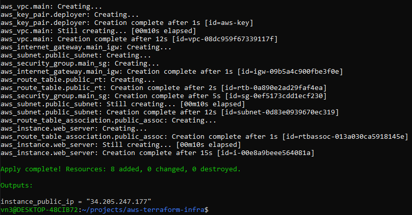
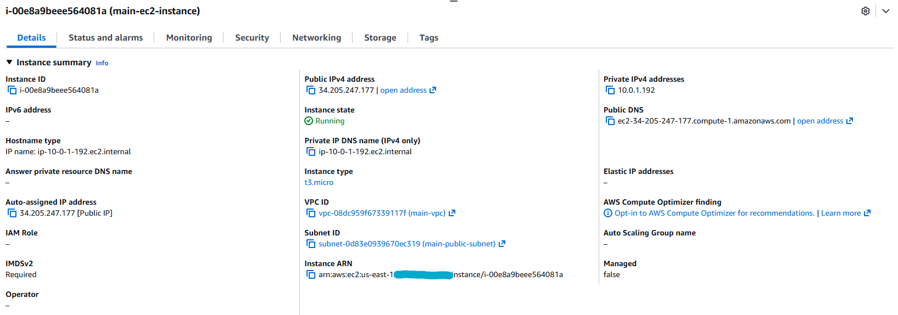
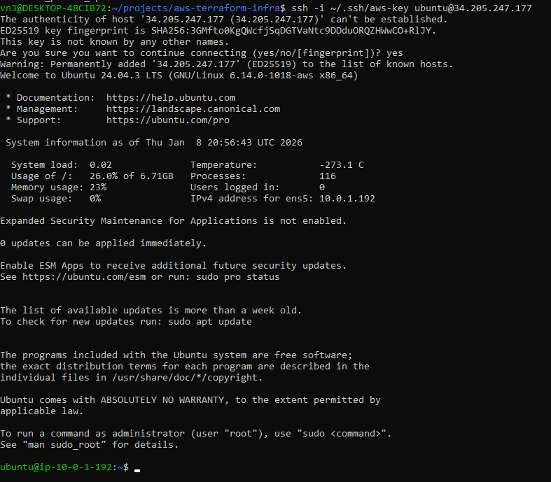

# AWS Infrastructure with Terraform (IaC)

Este projeto demonstra o provisionamento de uma infraestrutura em nuvem profissional na **Amazon Web Services (AWS)** utilizando **Terraform** como ferramenta de **Infrastructure as Code (IaC)**.

---

## 🏗️ Visão Geral da Arquitetura / Architecture Overview
A infraestrutura é implantada na região **us-east-1** (**United States**) e inclui:
* **VPC:** Rede virtual isolada com bloco CIDR `10.0.0.0/16`.
* **Public Subnet:** Segmento de rede `10.0.1.0/24` com mapeamento automático de IP público.
* **Internet Gateway:** Para permitir comunicação entre a VPC e a internet.
* **Security Group:** SSH (Porta 22) restrito ao meu IP e HTTP (Porta 80) aberto.
* **EC2 Instance:** Servidor Ubuntu 24.04 LTS rodando em hardware `t3.micro` (**Free Tier**).

## 🛠️ Tecnologias e Ferramentas / Technologies & Tools
* **Cloud:** AWS
* **IaC:** Terraform
* **Local OS:** Ubuntu via **WSL2** no Windows 11.
* **Terminal:** **Windows Terminal**.
* **Security:** **Windows Security** e Chaves SSH (ED25519).

---

## 📸 Validação Visual / Visual Validation

### 1. Provisionamento / Provisioning (Terraform Apply)
O Terraform gerenciou com sucesso a criação de 8 recursos integrados na AWS.


### 2. AWS Console
Confirmação da instância `main-ec2-instance` em estado **Running** com as tags e configurações de rede corretas.


### 3. Acesso Remoto / Remote Access (SSH)
Acesso bem-sucedido ao servidor nos **United States** via **Windows Terminal**, confirmando a integridade das chaves e das regras de firewall.


---

## 📖 Como Rodar / How to Run
1. **Configurar AWS CLI:** Execute `aws configure` no terminal.
2. **Variáveis:** Crie um arquivo `terraform.tfvars` com seu IP: `my_public_ip = "seu.ip.aqui"`.
3. **Comandos:**
   ```bash
   terraform init
   terraform plan
   terraform apply